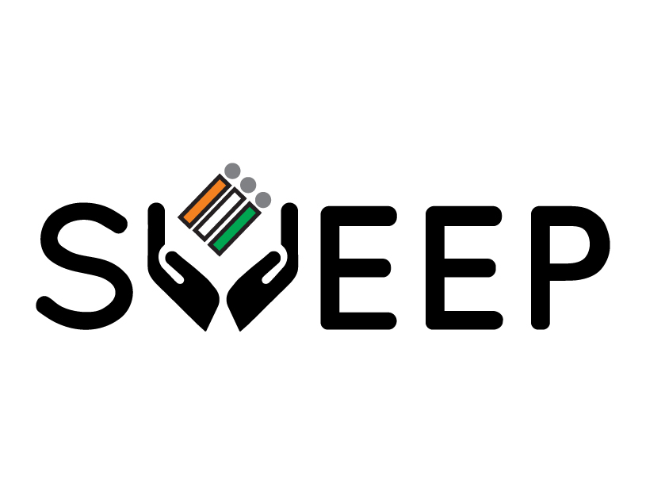

<p align="center">
  
</p>

<h1 align="center">🗳️ SVEEP Kottayam - Voter Pledge Portal</h1>

<p align="center">
  <strong>Official Voter Pledge Portal for Kottayam District</strong><br>
  <em>Systematic Voters' Education and Electoral Participation (SVEEP)</em>
</p>

<p align="center">
  <a href="#features">Features</a> •
  <a href="#tech-stack">Tech Stack</a> •
  <a href="#quick-start">Quick Start</a> •
  <a href="#deployment">Deployment</a> •
  <a href="#certificate-design">Certificate</a>
</p>

<p align="center">
  
  
  
  
</p>

<p align="center">
  
  
  
</p>

---

## 📋 About

The **SVEEP Kottayam Voter Pledge Portal** is an official initiative by the **Election Commission of India** to encourage voter participation and awareness. Citizens can take the voting pledge online and receive a personalized, professionally designed certificate instantly.

> 🇮🇳 *"Your Vote is Your Voice - Make it Count!"*

---

## ✨ Features

<table>
<tr>
<td width="50%">

### 🎯 Core Features
- ✅ **Online Pledge Form** - Simple, accessible form
- ✅ **Auto Certificate Generation** - Instant PDF-quality certificates
- ✅ **Multi-language Support** - English, Hindi, Malayalam
- ✅ **Mobile Responsive** - Works on all devices
- ✅ **Dark/Light Mode** - User preference support

</td>
<td width="50%">

### 🔧 Technical Features
- 🚀 **Real-time Database** - Firebase Firestore
- 📊 **Live Statistics** - Pledge counter
- 🔒 **Secure** - Government-grade security
- ♿ **Accessible** - WCAG compliant
- 📱 **PWA Ready** - Install as app

</td>
</tr>
</table>

---

## 🛠️ Tech Stack

| Category | Technology |
|----------|------------|
| **Frontend** | Next.js 16, React 19, TypeScript |
| **Styling** | Tailwind CSS, shadcn/ui |
| **Backend** | Firebase (Firestore, Storage, Functions) |
| **Certificate** | Sharp, SVG-to-PNG |
| **Deployment** | Vercel (Frontend), Firebase (Backend) |
| **Package Manager** | pnpm |

---

## 📁 Project Structure

```
kottayam-voting-RSVP/
├── 📂 app/                     # Next.js App Router
│   ├── 📄 layout.tsx          # Root layout with providers
│   ├── 📄 page.tsx            # Home page
│   ├── 📂 about/              # About SVEEP page
│   ├── 📂 contact/            # Contact page
│   ├── 📂 faq/                # FAQ page
│   └── 📂 privacy-policy/     # Privacy policy
│
├── 📂 components/              # React Components
│   ├── 📄 navbar.tsx          # Navigation with language switcher
│   ├── 📄 pledge-form.tsx     # Main pledge form
│   ├── 📄 success-view.tsx    # Certificate display
│   ├── 📄 news-ticker.tsx     # Scrolling announcements
│   ├── 📄 stats-section.tsx   # Live statistics
│   ├── 📄 faq-section.tsx     # FAQ accordion
│   └── 📂 ui/                 # shadcn/ui components
│
├── 📂 functions/               # Firebase Cloud Functions
│   └── 📂 src/
│       ├── 📄 index.ts        # Certificate generation
│       ├── 🖼️ sveep-logo.png
│       └── 🖼️ ec-logo.png
│
├── 📂 lib/                     # Utilities & Contexts
│   ├── 📄 language-context.tsx # i18n provider
│   ├── 📄 accessibility-context.tsx
│   └── 📄 utils.ts
│
├── 📂 public/                  # Static Assets
│   ├── 🖼️ sveep-logo.png
│   ├── 🖼️ ec-logo.png
│   └── 📄 manifest.json
│
├── 📄 firebase.ts              # Firebase config
├── 📄 firestore.rules          # Database security
└── 📄 storage.rules            # Storage security
```

---

## 🚀 Quick Start

### Prerequisites

- **Node.js** 18+ 
- **pnpm** (recommended) or npm
- **Firebase CLI** installed globally
- Firebase project with **Blaze plan**

### Installation

```bash
# 1. Clone the repository
git clone https://github.com/adi3433/KOTTAYAM-GOVT..git
cd KOTTAYAM-GOVT.

# 2. Install dependencies
pnpm install

# 3. Install function dependencies
cd functions && pnpm install && cd ..

# 4. Set up environment variables
cp .env.example .env.local
# Edit .env.local with your Firebase credentials

# 5. Run development server
pnpm dev
```

Open [http://localhost:3000](http://localhost:3000) 🎉

---

## 🔥 Firebase Setup

### 1. Create Firebase Project

1. Go to [Firebase Console](https://console.firebase.google.com)
2. Create new project: `sveep-kottayam`
3. Enable **Firestore Database**
4. Enable **Cloud Storage**
5. Enable **Cloud Functions** (requires Blaze plan)

### 2. Configure Credentials

Update `firebase.ts` with your project config:

```typescript
const firebaseConfig = {
  apiKey: "your-api-key",
  authDomain: "your-project.firebaseapp.com",
  projectId: "your-project-id",
  storageBucket: "your-project.appspot.com",
  messagingSenderId: "123456789",
  appId: "your-app-id"
};
```

### 3. Deploy Firebase Resources

```bash
# Login to Firebase
firebase login

# Select your project
firebase use your-project-id

# Deploy everything
firebase deploy
```

---

## 📜 Certificate Design

<table>
<tr>
<td>

### 🎨 Design Specifications

| Property | Value |
|----------|-------|
| **Dimensions** | 1200 × 850 px |
| **Background** | Maroon gradient |
| **Borders** | Multiple golden frames |
| **Font** | Georgia (serif) |
| **Format** | PNG |

</td>
<td>

### 🏷️ Certificate Elements

- 🏛️ **SVEEP Logo** (top-left)
- 🇮🇳 **EC Logo** (top-right)
- 📝 **Personalized Name**
- 📅 **Issue Date**
- ✍️ **District Collector Signature**
- 🔏 **Watermark**

</td>
</tr>
</table>

---

## 🗄️ Database Schema

### `pledges` Collection

```typescript
interface Pledge {
  fullName: string;
  email: string;
  phone: string;
  gender: "male" | "female" | "other";
  department: string;
  certificateUrl: string;        // Auto-generated
  certificateGeneratedAt: Timestamp;
  createdAt: Timestamp;
}
```

---

## 🌐 API Endpoints

### Cloud Functions

| Function | Type | Description |
|----------|------|-------------|
| `generateCertificate` | Firestore Trigger | Auto-generates certificate on new pledge |
| `downloadCertificate` | HTTPS | Download certificate by pledge ID |

**Download Endpoint:**
```
GET https://us-central1-[project-id].cloudfunctions.net/downloadCertificate?id=[pledgeId]
```

---

## 🚢 Deployment

### Frontend (Vercel)

```bash
# Install Vercel CLI
npm i -g vercel

# Deploy
vercel --prod
```

### Backend (Firebase)

```bash
# Deploy all Firebase resources
firebase deploy

# Deploy only functions
firebase deploy --only functions

# Deploy only rules
firebase deploy --only firestore:rules,storage:rules
```

---

## 🤝 Contributing

This is an official government project. For contributions or issues:

1. Contact the **District Election Office, Kottayam**
2. Email: **deokottayam@gmail.com**
3. Phone: **1950** (National Voter Helpline)

---

## 📄 License

This project is developed under the **Election Commission of India** guidelines.

<p align="center">
  <strong>SVEEP Kottayam District</strong><br>
  <em>in association with</em><br>
  Indian Institute of Information Technology Kottayam
</p>

---

<p align="center">
  Made with ❤️ for Indian Democracy<br>
  <strong>🗳️ Every Vote Counts!</strong>
</p>
